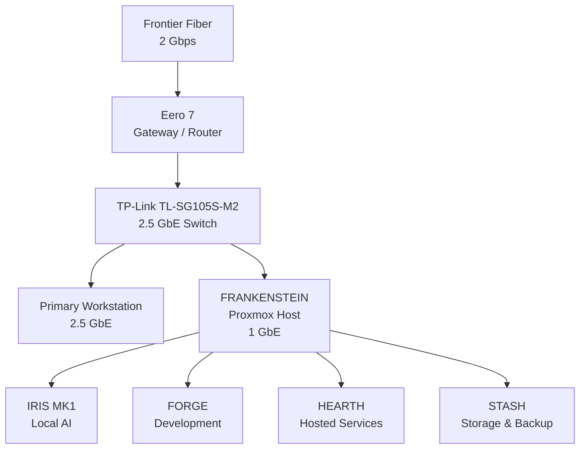
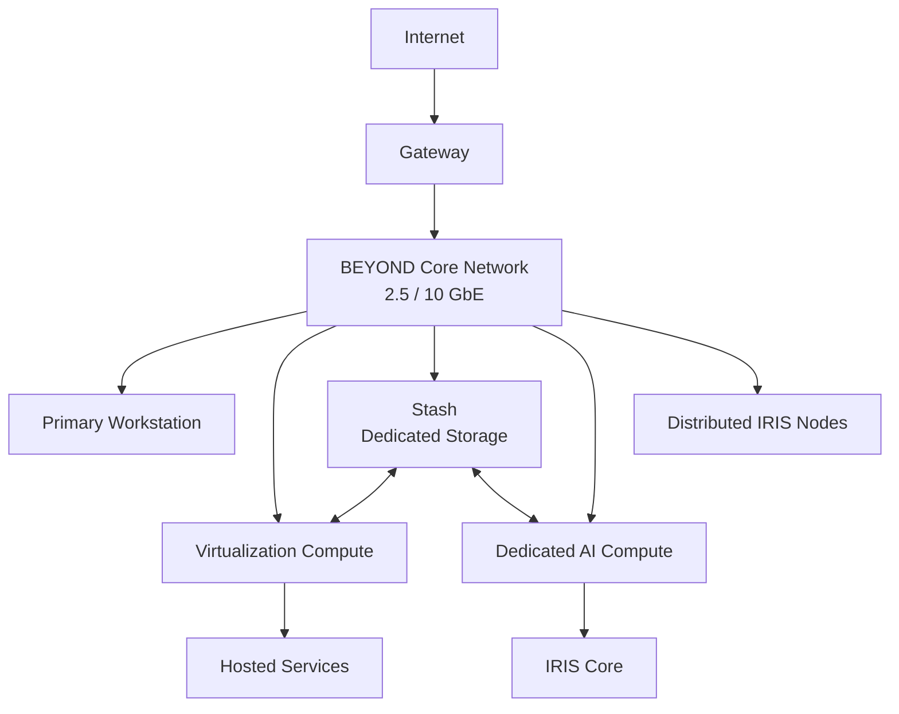

# Project BEYOND

### Build Everything Your Old Man Never Did.

Project BEYOND is a continuously evolving homelab built around virtualization,
local AI, networking, cybersecurity, automation, storage, and self-hosted
infrastructure.

The project began with repurposed hardware and a simple objective:

**Build useful systems, learn how they work, identify their limitations, and
improve them.**

BEYOND is not intended to become an enterprise datacenter for the sake of having
enterprise hardware.

Every system should have a purpose.

Every upgrade should solve a problem.

And whenever possible, the improvement should be measurable.

---

## Current Architecture

BEYOND currently operates primarily from a single Proxmox virtualization host,
**Frankenstein**, connected to a 2.5 GbE network.



The current architecture works.

It is also intentionally unfinished.

BEYOND is gradually moving from one physical system performing several roles
toward dedicated infrastructure for compute, storage, networking, services,
and AI.

---

## Core Systems

### Frankenstein

**Primary Virtualization & Compute Host**

Frankenstein is the current physical foundation of BEYOND.

Built primarily from repurposed desktop hardware, it runs Proxmox VE and hosts
the project's primary virtual environments.

Current hardware includes:

- Intel Core i7-8700K
- 64 GB DDR4
- NVIDIA GeForce RTX 2060 SUPER
- NVIDIA GeForce GTX 1660
- 4 TB NVMe VM storage
- 18 TB Seagate Exos bulk storage
- Corsair RM750 PSU
- 1 GbE networking

Frankenstein was never intended to be the final architecture.

Its job was to give BEYOND somewhere to begin.

[View the Frankenstein build documentation](../projects/frankenstein/build.md)

---

### IRIS

**Local AI System**

IRIS is BEYOND's locally hosted AI platform.

IRIS MK1 currently runs inside a Debian virtual machine on Frankenstein and
uses an NVIDIA GeForce RTX 2060 SUPER for GPU-accelerated local inference.

Current development includes:

- Local AI inference
- Ollama
- Custom Python API
- GPU acceleration
- Text interaction
- Voice interaction
- Future infrastructure integration

The long-term objective is to move IRIS toward dedicated AI compute and
distributed interaction nodes throughout the environment.

[View the IRIS documentation](../projects/iris/README.md)

---

### Forge

**Development Environment**

Forge is BEYOND's dedicated development environment.

It provides an isolated Windows environment for:

- Python
- PowerShell
- Git
- Visual Studio Code
- Automation development
- API development
- Infrastructure tooling
- Testing

The basic workflow is:

```text
Idea
  ↓
Forge
  ↓
Test
  ↓
Git
  ↓
Deploy
  ↓
Document
```

Forge builds.

The rest of BEYOND runs.

[View the Forge documentation](../projects/forge/README.md)

---

### Hearth

**Hosted Services**

Hearth provides a dedicated environment for persistent applications and game
servers.

It currently runs Debian 13 and hosts BEYOND's first operational game-server
workload:

**Palworld Dedicated Server**

The server runs as a persistent systemd service.

Future Hearth workloads may include:

- Additional game servers
- Minecraft
- Internal applications
- Web services
- Automation services
- Monitoring tools
- Containerized applications

If it needs to stay running, it shouldn't live in Forge.

[View the Hearth documentation](../projects/hearth/README.md)

---

### Stash

**Storage & Backup**

Stash is BEYOND's storage layer.

The current implementation uses an 18 TB Seagate Exos enterprise HDD installed
inside Frankenstein and exposed to Proxmox as dedicated storage.

Current Stash provides capacity.

The long-term objective is to provide independent storage infrastructure with:

- Dedicated storage hardware
- Redundancy
- Drive-health monitoring
- Network-accessible storage
- Backup infrastructure
- Expandable capacity
- High-speed networking

**Capacity and architecture are not the same thing.**

[View the Stash documentation](../projects/stash/README.md)

---

## Benchmarks & Testing

BEYOND documents performance before changing infrastructure.

The goal is to establish repeatable baselines, identify actual bottlenecks, and
measure whether future upgrades solve the problems they were intended to solve.

### Current Benchmarks

| Benchmark | System | Result |
|---|---|---|
| [Benchmark 001 — Frankenstein 1 GbE Baseline](../tests/network/frankenstein-1gbe-baseline.md) | Frankenstein / BEYOND Network | 946 Mbit/s inbound, 937 Mbit/s outbound, 946 Mbit/s four-stream aggregate |

### Benchmark Philosophy

Hardware upgrades should answer a measurable question.

Instead of:

> The new hardware feels faster.

BEYOND aims to document:

```text
Problem
   ↓
Baseline
   ↓
Upgrade
   ↓
Repeat Test
   ↓
Compare Results
   ↓
Document Findings
```

Current and future testing may include:

- Network throughput
- Network latency
- Storage performance
- VM storage performance
- GPU performance
- AI inference performance
- System resource utilization
- Thermal behavior
- Power consumption
- Service performance

Where possible, hardware evaluations will use the same tests before and after
an upgrade so results can be compared directly.

**If we can't measure the improvement, we don't really know what improved.**

---

## Network

BEYOND currently uses:

- Frontier 2 Gbps fiber
- Eero 7 gateway/router
- TP-Link TL-SG105S-M2 2.5 GbE switch
- 2.5 GbE primary workstation
- 1 GbE Frankenstein connection

The current network benchmark has confirmed that Frankenstein can effectively
saturate its existing gigabit connection.

That makes increasing Frankenstein's physical network speed one of the clearest
current infrastructure upgrade opportunities.

Future development may include:

- 2.5 GbE
- 10 GbE
- SFP+
- DAC connectivity
- Managed switching
- Dedicated storage networking
- Infrastructure monitoring

[View the network documentation](network.md)

---

## Hardware

BEYOND intentionally uses a mixture of repurposed consumer hardware and
enterprise-oriented components.

The purpose is not to build the most expensive system possible.

The purpose is to determine what hardware is actually useful.

Hardware is evaluated based on:

- Compatibility
- Deployment experience
- Performance
- Reliability
- Integration
- Limitations
- Measurable improvement
- Long-term usefulness

[View the hardware inventory](hardware.md)

---

## Roadmap

The long-term direction of BEYOND is to move away from a single physical host
performing nearly every role.

The target architecture separates major infrastructure responsibilities.



Major development goals include:

- Multi-gigabit Frankenstein networking
- Dedicated storage infrastructure
- Storage redundancy
- Dedicated AI compute
- Expanded IRIS capabilities
- Distributed IRIS nodes
- Centralized monitoring
- Tested backup and recovery
- Rack-mounted infrastructure
- 10 GbE backbone

[View the full BEYOND roadmap](roadmap.md)

---

## Hardware Testing & Collaboration

Project BEYOND is open to evaluating hardware relevant to the project's
documented infrastructure roadmap.

Areas of interest include:

- Network adapters
- Multi-gigabit switches
- 10 GbE equipment
- SFP+ hardware
- DAC cables
- Storage hardware
- NAS hardware
- Enterprise drives
- SSDs
- HBAs
- Rack equipment
- UPS and power equipment
- Monitoring hardware
- Mini PCs
- Server hardware
- GPU compute hardware
- AI infrastructure

Testing focuses on real deployment inside an operational homelab rather than
isolated product demonstrations.

Where appropriate, evaluations may include:

- Installation and deployment
- Compatibility
- Configuration
- Before-and-after benchmarks
- Performance measurements
- Integration with existing infrastructure
- Limitations discovered during use
- Long-term observations

Hardware provided by a manufacturer, vendor, or other organization will be
clearly disclosed.

**Receiving hardware does not guarantee a positive review.**

---

## Project Philosophy

BEYOND follows a simple process:

```text
Build it.
    ↓
Test it.
    ↓
Learn from it.
    ↓
Document it.
    ↓
Find the limitation.
    ↓
Improve it.
    ↓
Repeat.
```

The hardware will change.

The architecture will change.

Some experiments will work.

Some will fail.

Both are worth documenting.

---

## Why BEYOND Exists

Project BEYOND is ultimately about building something that can continue to
grow.

It is a place to experiment with infrastructure, software, AI, networking,
automation, storage, and security while documenting both the successes and the
mistakes.

The goal isn't to pretend the lab is finished.

The goal is to make sure it never stops teaching something.

---

# Build Everything Your Old Man Never Did.

**Build it. Test it. Learn from it. Document it.**
