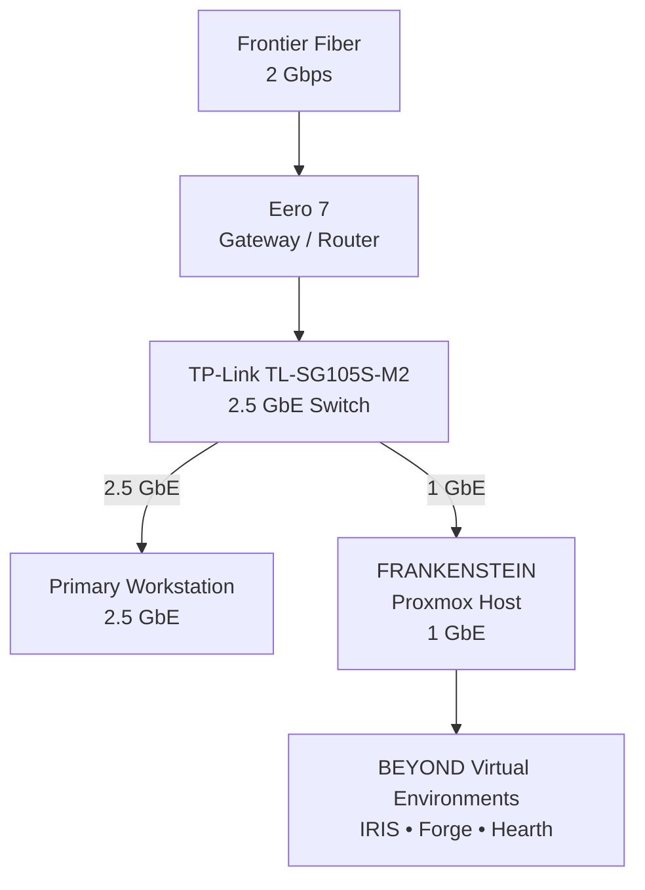
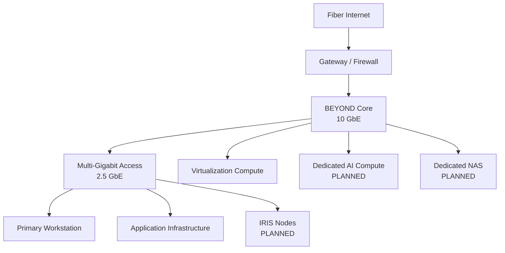

# Project BEYOND — Network

Project BEYOND uses a dedicated multi-gigabit network to connect its compute,
storage, development, and administrative systems.

The network has evolved from an early configuration that depended on the primary
workstation into an independent infrastructure layer capable of operating
without the workstation being online.

> This documentation represents the logical and physical architecture of the
> BEYOND network. IP addresses, MAC addresses, credentials, and security-sensitive
> configuration are intentionally excluded.

---

# Current Network

BEYOND currently uses a 2.5 GbE switching backbone connected to a 2 Gbps fiber
internet connection.

---

## Internet Connection

BEYOND is connected through a 2 Gbps fiber internet service.

Internet connectivity enters the environment through the primary gateway before
reaching the BEYOND switching infrastructure.

---

## Gateway

### Eero 7

The Eero 7 currently provides gateway and routing services between the fiber
connection and the BEYOND network.

BEYOND does not depend on the primary workstation for network connectivity.

This allows infrastructure hosted on Frankenstein to remain available even when
the workstation is powered off or disconnected.

---

## Core Switching

### TP-Link TL-SG105S-M2

The current BEYOND switching layer is built around a TP-Link TL-SG105S-M2
multi-gigabit Ethernet switch.

The switch provides 2.5 GbE connectivity for supported endpoints and forms the
current high-speed backbone of the lab.

### Current Backbone

**2.5 GbE**

This provides sufficient bandwidth for the current environment while creating a
migration path toward faster compute and storage networking.

---

# Connected Systems

## Primary Workstation

The primary workstation connects to the BEYOND network at 2.5 GbE.

Its role includes:

- Infrastructure administration
- Development
- Proxmox management
- BEYOND documentation
- Testing
- Access to hosted services

The workstation is an administrative endpoint rather than a required component
of BEYOND infrastructure.

BEYOND remains operational when the workstation is offline.

---

## Frankenstein

Frankenstein currently connects to the 2.5 GbE BEYOND switching infrastructure
through a 1 GbE network interface.

Frankenstein hosts the majority of BEYOND's current compute workloads,
including:

- IRIS
- Forge
- Hearth
- Virtualized services
- VM storage
- Bulk storage

Because the host currently operates at 1 GbE, Frankenstein's network interface
is an identified bottleneck within the existing architecture.

This provides a clear opportunity for future network testing and upgrades.

---

# Network Evolution

BEYOND's networking architecture is being developed in stages.

## Stage 1 — Independent Network

**Status: Complete**

The first objective was removing BEYOND's dependency on the primary workstation
for basic network connectivity.

The infrastructure can now operate independently while the workstation functions
only as an administrative and development endpoint.

---

## Stage 2 — Multi-Gigabit Backbone

**Status: Active**

The current TP-Link switching infrastructure provides a 2.5 GbE backbone.

The primary workstation already uses multi-gigabit connectivity, while
Frankenstein remains limited to 1 GbE.

A future Frankenstein NIC upgrade will allow testing of the practical difference
between 1 GbE and multi-gigabit connectivity within the same environment.

---

## Stage 3 — 10 GbE Infrastructure

**Status: Planned**

The long-term network architecture includes migration toward 10 GbE for
high-bandwidth infrastructure.

Potential 10 GbE workloads include:

- Virtual machine migration
- High-speed backups
- NAS connectivity
- AI model storage
- Large dataset transfers
- Dedicated AI compute
- Future rack-mounted servers

The goal is not necessarily to move every BEYOND endpoint to 10 GbE.

Instead, 10 GbE will be targeted toward systems where increased bandwidth
provides a measurable benefit.

---

# Target Network Architecture

---

# Network Upgrade Priorities

Current network development priorities include:

1. Upgrade Frankenstein beyond its current 1 GbE limitation
2. Establish repeatable network performance benchmarks
3. Introduce dedicated network storage
4. Evaluate 10 GbE switching
5. Add 10 GbE connectivity to high-bandwidth systems
6. Improve infrastructure monitoring
7. Introduce additional segmentation as BEYOND expands
8. Document performance changes after each major upgrade

---

# Testing Philosophy

Network upgrades within BEYOND should produce measurable results.

Where practical, upgrades will be evaluated using baseline and post-upgrade
testing including:

- Throughput
- File transfer performance
- VM transfer performance
- Storage performance
- Latency
- Reliability
- Power consumption
- Thermal behavior
- Configuration complexity

This allows BEYOND to evaluate whether an infrastructure upgrade provides a
meaningful real-world improvement rather than relying solely on advertised
specifications.

---

# Future Hardware Evaluation

Networking equipment that fits the BEYOND roadmap may be evaluated as part of
future infrastructure upgrades.

Areas of interest include:

- 2.5 GbE network adapters
- 10 GbE network adapters
- Multi-gigabit switches
- 10 GbE switches
- SFP+ infrastructure
- DAC cabling
- Network monitoring hardware
- Managed switching
- High-speed NAS connectivity

Any hardware supplied by a manufacturer or vendor will be clearly disclosed,
and testing results will remain independent of the source of the equipment.
