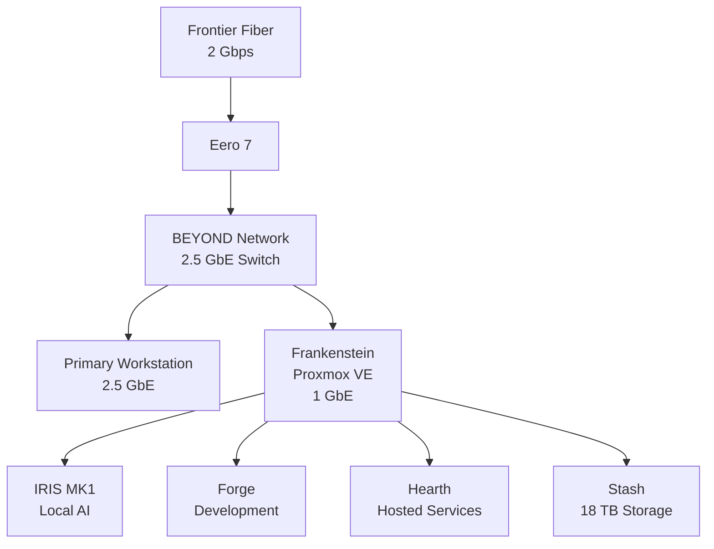
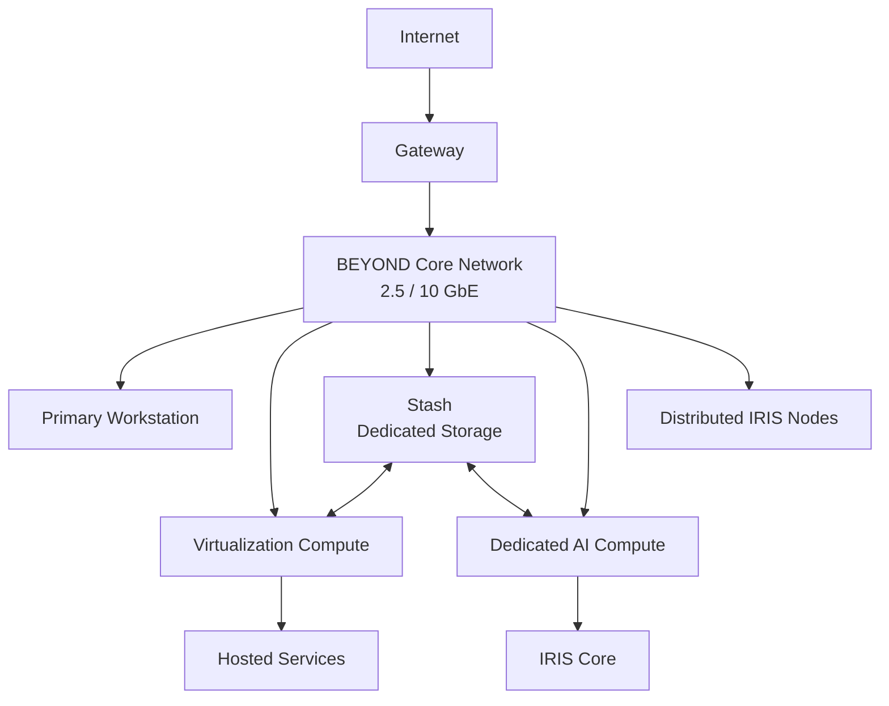

# Project BEYOND Roadmap

Project BEYOND is being built incrementally.

The objective is not to design an ideal homelab on paper and purchase everything
at once.

BEYOND starts with available hardware, builds functional systems, identifies
real limitations, and upgrades when those limitations justify it.

This roadmap tracks that evolution.

---

# Current State

BEYOND currently operates primarily from a single physical compute host:
**Frankenstein**.

Frankenstein provides the virtualization platform supporting the project's
primary environments.



This architecture is functional.

It is also intentionally unfinished.

---

# Current Systems

| System | Role | Status |
|---|---|---|
| Frankenstein | Proxmox virtualization / compute | Operational |
| IRIS MK1 | Local AI | Operational / Active Development |
| Forge | Development environment | Operational |
| Hearth | Hosted services / game servers | Operational |
| Stash | Bulk storage | Operational / Direct Attached |
| BEYOND Network | Network infrastructure | Operational / Expanding |
| Distributed IRIS Nodes | Voice / interaction endpoints | Planned |
| Dedicated Storage Host | Independent storage | Planned |
| Dedicated AI Compute | AI acceleration | Planned |
| 10 GbE Backbone | High-speed infrastructure network | Planned |

---

# Phase 1 — Establish the Foundation

**Status: Operational**

The first phase of BEYOND was about proving that the environment could exist
using primarily repurposed hardware.

Major milestones:

- Build Frankenstein
- Install Proxmox VE
- Establish remote administration
- Deploy IRIS
- Deploy Forge
- Deploy Hearth
- Establish Stash
- Add GPU acceleration
- Establish dedicated BEYOND switching
- Remove dependency on the primary workstation for BEYOND operation

This phase created the foundation.

It also exposed the limitations that define the next phases.

---

# Phase 2 — Measure the Current Platform

**Status: Active**

Before replacing hardware, BEYOND needs baseline measurements.

The purpose of this phase is to establish what the current environment can
actually do.

Planned measurements include:

- Frankenstein CPU performance
- VM storage performance
- Stash storage performance
- Network throughput
- Network latency
- IRIS inference performance
- GPU utilization
- GPU memory utilization
- Model loading behavior
- Power consumption where measurable
- Service resource utilization

These measurements will provide a baseline for future upgrades.

An upgrade becomes much more useful when its effect can be measured.

Instead of:

> The new hardware feels faster.

BEYOND should be able to say:

> Here was the original result. Here is the new result. Here is what changed.

---

# Phase 3 — Network Expansion

**Status: Active / Planned**

The BEYOND switching layer currently supports 2.5 GbE.

The primary workstation can use that connectivity.

Frankenstein currently cannot.

Its physical network connection remains 1 GbE.

That makes host networking one of the clearest current bottlenecks.

## Near-Term Goal

Move Frankenstein beyond 1 GbE.

Potential paths include:

- 2.5 GbE PCIe NIC
- 10 GbE PCIe NIC
- SFP+ networking
- DAC connectivity

## Long-Term Goal

Establish a high-speed backbone between major BEYOND systems.

```text
             BEYOND CORE
               10 GbE
                  │
       ┌──────────┼──────────┐
       │          │          │
 Frankenstein   Stash    AI Compute
```

This becomes increasingly important as storage and compute are separated.

---

# Phase 4 — Separate Storage

**Status: Planned**

Stash currently exists as an 18 TB Seagate Exos drive installed directly inside
Frankenstein.

This provides capacity but couples storage to compute.

The next major storage evolution is to make Stash independent.

Goals include:

- Dedicated storage hardware
- Multiple-drive capability
- Storage redundancy
- Drive-health monitoring
- Network-accessible storage
- Backup infrastructure
- Expandable capacity
- High-speed connectivity

The goal is to move from:

```text
Frankenstein
    │
    └── Stash
```

to:

```text
        BEYOND Network
          /        \
         /          \
Frankenstein       Stash
   Compute         Storage
```

---

# Phase 5 — Expand IRIS

**Status: Active**

IRIS MK1 currently provides locally hosted AI using an RTX 2060 SUPER.

Current development includes:

- Local inference
- Ollama
- Custom IRIS API
- GPU acceleration
- Text interaction
- Voice experimentation

The next stage focuses on making IRIS more useful rather than simply making the
model larger.

Potential development includes:

- Improved voice pipeline
- Infrastructure integration
- Monitoring integration
- Automation
- Improved model management
- Additional interfaces
- Distributed node communication

---

# Phase 6 — Distributed IRIS

**Status: Planned**

IRIS is ultimately intended to exist beyond a single interface.

Distributed IRIS nodes would provide interaction points throughout the
environment.

A node may eventually contain:

- Microphone
- Speaker
- Small network-connected computer
- Push-to-talk or wake interaction
- Status indication

The central AI workload remains within BEYOND infrastructure.

```text
IRIS Node
    │
    ▼
BEYOND Network
    │
    ▼
IRIS Core
    │
    ▼
AI Compute
```

This allows lightweight endpoints to use centralized AI resources.

---

# Phase 7 — Dedicated AI Compute

**Status: Planned**

IRIS currently uses an NVIDIA GeForce RTX 2060 SUPER with 8 GB of VRAM.

That is enough to build and test the first generation of the system.

It is not intended to be the final compute platform.

Frankenstein also contains a GTX 1660, but the card is currently unusable by
IRIS because of the existing PCIe/IOMMU configuration and physical slot
limitations.

As IRIS grows, dedicated AI hardware becomes increasingly useful.

Future requirements may include:

- Increased VRAM
- Larger local models
- Faster inference
- Multiple simultaneous AI workloads
- Speech processing
- Multimodal workloads
- Multi-GPU experimentation
- Persistent AI services

The target architecture eventually separates AI compute from general-purpose
virtualization.

```text
               BEYOND Network
                     │
        ┌────────────┼────────────┐
        │            │            │
 Frankenstein      Stash      AI Compute
 Virtualization   Storage        GPUs
                                  │
                                  ▼
                                IRIS
```

---

# Phase 8 — Rack Infrastructure

**Status: Planned**

As dedicated systems are introduced, BEYOND will eventually transition toward
rack-mounted infrastructure.

Potential rack components include:

- Virtualization servers
- Storage server
- AI compute
- Managed switching
- 10 GbE networking
- Patch panels
- UPS
- Power distribution
- Monitoring hardware

Rack infrastructure is not the objective by itself.

It becomes useful when BEYOND has enough independent systems to justify
centralizing them.

---

# Phase 9 — Monitoring and Observability

**Status: Planned**

As BEYOND becomes more distributed, manually checking every system becomes less
practical.

Future monitoring should provide visibility into:

- Host availability
- VM availability
- CPU utilization
- Memory utilization
- Storage capacity
- Disk health
- Network utilization
- GPU utilization
- GPU memory
- Service availability
- Temperatures
- Backup status

Eventually, BEYOND should identify problems before a user has to discover them.

---

# Phase 10 — Backup and Recovery

**Status: Planned**

A functioning homelab is useful.

A functioning homelab that can survive failure is better.

Future development will establish documented recovery procedures for:

- Frankenstein
- IRIS
- Forge
- Hearth
- Stash
- BEYOND configuration
- Project documentation

This includes both creating backups and proving that those backups can be
restored.

**A backup that has never been tested is only a theory.**

---

# Current Known Limitations

BEYOND currently has several documented infrastructure limitations.

| Limitation | Current State | Target |
|---|---|---|
| Frankenstein networking | 1 GbE | 2.5 / 10 GbE |
| Stash | Single 18 TB DAS drive | Dedicated redundant storage |
| AI GPU | RTX 2060 SUPER 8 GB | Dedicated AI compute |
| Secondary GPU | Installed but unusable | Resolve or replace architecture |
| Physical host count | Primarily one | Multiple dedicated systems |
| Failure domain | Frankenstein hosts most workloads | Distributed infrastructure |
| Monitoring | Limited | Centralized monitoring |
| Backup architecture | Developing | Tested recovery strategy |
| IRIS endpoints | Centralized | Distributed nodes |

These limitations form much of the BEYOND development roadmap.

---

# How Hardware Is Evaluated

BEYOND hardware should solve a documented problem.

Testing should answer questions such as:

- What limitation is this hardware intended to solve?
- How difficult is it to deploy?
- Does it work with the existing environment?
- What changed after installation?
- What performance difference can be measured?
- What problems remain?
- Would the hardware remain part of BEYOND after testing?

Where possible, testing will include measurable before-and-after results.

---

# Hardware Collaboration

Project BEYOND is open to evaluating hardware relevant to the project's
documented infrastructure roadmap.

Potential areas include:

- Network adapters
- Multi-gigabit switches
- 10 GbE hardware
- SFP+ equipment
- Storage hardware
- NAS hardware
- Enterprise drives
- SSDs
- HBAs
- Rack equipment
- UPS and power equipment
- Monitoring hardware
- Mini PCs
- Server hardware
- GPU compute hardware
- AI infrastructure

Hardware provided by a manufacturer or vendor will be clearly disclosed.

Receiving hardware does not guarantee a positive review.

Testing will focus on actual deployment, measurable results, compatibility,
limitations, and long-term usefulness within BEYOND.

---

# The Long-Term Architecture

BEYOND is gradually moving from one machine doing almost everything toward
multiple systems with defined responsibilities.



The exact hardware will change.

The architectural direction is what matters.

---

# The Rule

BEYOND does not need to become an enterprise datacenter.

It needs to become a better system than it was yesterday.

The process remains:

**Build it.**

**Test it.**

**Find the limitation.**

**Document it.**

**Improve it.**

Then repeat.
