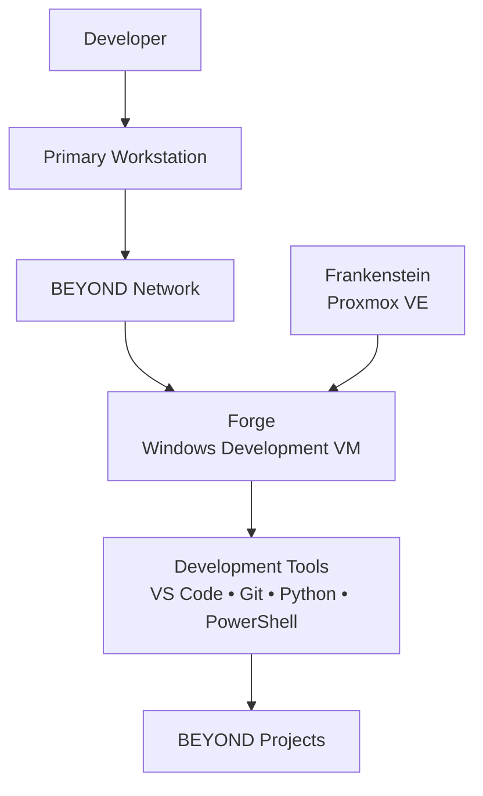
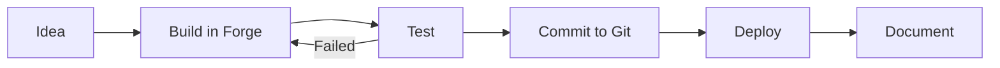

# Forge

### Development Environment for Project BEYOND

Forge is the dedicated development environment for Project BEYOND.

While Frankenstein provides infrastructure and IRIS provides local AI,
Forge provides somewhere to build.

It exists so development, experimentation, scripting, and automation work can
take place in an isolated environment without turning the primary workstation
or production BEYOND services into development machines.

The objective is simple:

**Build it in Forge before trusting it somewhere else.**

---

# The Goal

BEYOND includes infrastructure, automation, AI, networking, and software
projects.

Those projects need somewhere to be developed and tested.

Forge provides a dedicated Windows development environment for:

- Python development
- PowerShell development
- Automation
- Git-based projects
- Infrastructure tooling
- API development
- Testing
- Experimentation
- BEYOND utilities

Rather than installing every development dependency on the primary workstation,
Forge provides an environment that can evolve specifically around development.

---

# Current Architecture

Forge currently runs as a Windows virtual machine hosted by Frankenstein.



The primary workstation acts as the administrative endpoint.

The development environment itself lives inside BEYOND.

---

# Current VM Configuration

| Component | Configuration |
|---|---|
| Host | Frankenstein |
| Hypervisor | Proxmox VE |
| Operating System | Windows 11 Pro |
| vCPU | 4 |
| Memory | 16 GB |
| Virtual Disk | 200 GB |
| Filesystem | NTFS |
| Network Adapter | Red Hat VirtIO Ethernet Adapter |
| Python | 3.14 |
| Git | 2.55 |
| Visual Studio Code | 1.134 |
| Docker | Not currently installed |

Forge currently has substantial unused local disk capacity, leaving room for
development tools, repositories, SDKs, test data, and future development
workloads.

---

# Why a Dedicated Development VM?

Development environments change constantly.

New packages get installed.

Dependencies conflict.

Experiments break.

Scripts do unexpected things.

Configuration changes accumulate.

That is normal during development.

It is less desirable on the workstation used to administer the rest of the
environment.

Forge separates those concerns.

```text
Primary Workstation
        │
        │ Administration
        ▼
   BEYOND Network
        │
        ▼
      Forge
        │
        ├── Development
        ├── Testing
        ├── Automation
        ├── Scripting
        └── Experimentation
```

If Forge becomes messy, it can be repaired, restored, rebuilt, or replaced
without rebuilding the primary workstation.

---

# Development Tools

Forge currently includes the core tools required for BEYOND development.

## Visual Studio Code

Visual Studio Code provides the primary development interface.

It can be used for:

- Python
- PowerShell
- Markdown
- Configuration files
- Git repositories
- Automation projects
- Documentation
- Future application development

---

## Python

Python is installed as a primary development language.

Current version:

```text
Python 3.14
```

Python provides a flexible platform for:

- Automation
- API development
- Data processing
- Infrastructure utilities
- AI integration
- BEYOND tooling

---

## Git

Git provides source control for development work.

Current version:

```text
Git 2.55
```

Git allows Forge projects to move between development, testing, documentation,
and public repositories without making the VM itself the only copy of the work.

---

## PowerShell

As a Windows development environment, Forge also provides PowerShell for
Windows-focused automation and administration development.

This is particularly useful for projects involving:

- Windows administration
- Microsoft infrastructure
- PowerShell automation
- REST APIs
- System configuration
- Infrastructure tooling

---

# Networking

Forge uses a virtual Red Hat VirtIO Ethernet adapter.

The guest currently reports a 10 Gbps virtual link.

This represents the virtual connection between Forge and the Proxmox networking
layer and should not be confused with Frankenstein's physical network speed.

Frankenstein currently connects to the BEYOND physical network at 1 GbE.

The effective external network performance available to Forge is therefore
ultimately constrained by the host's physical connectivity.

```text
Forge
  │
  │ VirtIO
  ▼
Frankenstein
  │
  │ 1 GbE
  ▼
BEYOND Network
```

This distinction is important when benchmarking network-dependent development
or storage workloads.

---

# Isolation

One of Forge's most important features is isolation.

Forge provides a boundary between experimental development work and other
BEYOND systems.

For example:

```text
                Frankenstein
                     │
        ┌────────────┼────────────┐
        │            │            │
       IRIS        Forge        Hearth
        │            │            │
        │       Development       │
        │       Experimentation   │
        │       Testing           │
        │                         │
       AI                      Services
```

Development work can happen inside Forge without requiring the same tools,
packages, and dependencies to exist inside IRIS or Hearth.

---

# Current Limitations

Forge is functional, but it is still an early implementation.

## Single Host Dependency

Forge currently depends entirely on Frankenstein.

If Frankenstein is unavailable, Forge is unavailable.

This is acceptable for the current development environment but remains part of
BEYOND's broader concentration of workloads on a single physical host.

---

## No Container Platform

Docker is not currently installed.

Containerized development may be introduced later if BEYOND projects create a
real requirement for it.

The absence of Docker is not currently treated as a problem that needs to be
solved simply for the sake of having it.

---

## Shared Physical Networking

Forge's virtual network adapter reports a high-speed virtual connection, but
external traffic still passes through Frankenstein's current 1 GbE physical
connection.

Future network upgrades to Frankenstein will therefore also benefit Forge.

---

## Resource Sharing

Forge shares Frankenstein's CPU, memory, storage, and physical infrastructure
with other BEYOND workloads.

As additional services are introduced, resource allocation between virtual
machines will need to be monitored.

---

# Development Workflow

The intended Forge workflow is:



Not every experiment needs to become permanent infrastructure.

Forge provides somewhere for ideas to fail safely before they become part of
BEYOND.

---

# Future Development

Forge will grow based on the projects being built inside it.

Potential additions include:

- Additional SDKs
- Container tooling
- Docker
- Linux development environments
- Automated testing
- CI/CD experimentation
- Infrastructure-as-code tooling
- Local Git services
- Build automation
- API testing tools
- Security testing tools
- Development databases
- Integration with IRIS
- Automated deployment into BEYOND

These capabilities will be introduced when projects create a reason for them.

---

# Relationship With IRIS

Forge and IRIS serve very different purposes.

IRIS is intended to become a persistent AI service.

Forge is intended to remain a development environment.

That creates the possibility for future workflows such as:

```text
Forge
  │
  │ Develop / Test
  ▼
IRIS API
  │
  ▼
IRIS
```

New IRIS functionality can eventually be developed and tested from Forge
before being deployed into the IRIS environment.

This keeps experimentation away from the operational AI system.

---

# Relationship With GitHub

GitHub provides the persistent source-control and documentation layer for
public BEYOND projects.

Forge provides the environment where many of those projects can be developed.

The two serve different purposes:

```text
Forge
  │
  │ Build
  ▼
Git
  │
  │ Commit / Push
  ▼
GitHub
  │
  ├── Source
  ├── Documentation
  └── Build History
```

The VM is disposable.

The work should not be.

---

# Future Role

Forge does not need dedicated enterprise hardware to accomplish its current
purpose.

Its value is in providing separation.

As BEYOND grows, Forge may eventually become part of a larger development
platform involving:

- Multiple development environments
- Automated builds
- Test infrastructure
- Version-controlled deployment
- Infrastructure automation
- CI/CD pipelines

For now, a single Windows VM provides enough capability to establish those
workflows.

---

# Development Philosophy

Forge exists because BEYOND needs somewhere safe to experiment.

Production infrastructure should not become a development environment simply
because it is convenient.

Build.

Break.

Fix.

Test.

Commit.

Deploy.

Document.

Then do it again.

**That's what Forge is for.**
