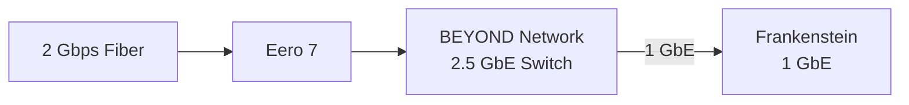

# Frankenstein — Building the Foundation of Project BEYOND

Frankenstein is the machine that turned Project BEYOND from an idea into an
actual environment.

The original goal wasn't to build the perfect server.

It was to take hardware I already had, build a dedicated virtualization host,
and create somewhere I could experiment with infrastructure, networking,
storage, development, automation, and locally hosted AI.

The result became Frankenstein.

The name turned out to be appropriate.

---

# The Goal

Frankenstein needed to become a flexible platform rather than another desktop
computer.

The original requirements included:

- Run a dedicated hypervisor
- Host multiple isolated environments
- Support local AI experimentation
- Support GPU acceleration
- Provide development infrastructure
- Host applications and dedicated game servers
- Provide large-capacity storage
- Operate headlessly
- Support remote administration
- Allow hardware to be added, removed, and repurposed over time

Most importantly, the initial system needed to be built primarily from hardware
that was already available.

The objective wasn't perfection.

**The objective was capability.**

---

# Attempt One — AMD

Frankenstein's first configuration was based around an AMD platform.

The initial build included:

- MSI B450 motherboard
- AMD Ryzen 7 5700X
- Existing DDR4 memory
- Repurposed storage
- Repurposed components

The system didn't successfully boot.

Troubleshooting repeatedly resulted in a CPU diagnostic condition.

Rather than continue buying components to troubleshoot a platform whose entire
purpose was supposed to be repurposing available hardware, the decision was made
to change direction.

That failure established one of Frankenstein's earliest design principles:

**The hardware doesn't need to be elegant. It needs to work.**

---

# Attempt Two — Frankenstein Lives

The second attempt used another collection of available hardware:

- Gigabyte Z370 AORUS Gaming 7
- Intel Core i7-8700K
- DDR4 memory

This configuration successfully POSTed.

Frankenstein was alive.

The platform wasn't new, but the i7-8700K provided:

- 6 physical cores
- 12 threads
- PCIe expansion
- NVMe support
- Enough compute capacity to begin building BEYOND

Instead of waiting until better hardware was available, development started with
what worked.

That decision continues to define BEYOND.

---

# Installing Proxmox

Proxmox VE was selected as Frankenstein's virtualization platform.

The intention from the beginning was for Frankenstein to become infrastructure,
not another workstation.

After initial installation and network configuration, administration moved to
the Proxmox web interface.

Frankenstein no longer required a dedicated:

- Monitor
- Keyboard
- Mouse
- Desktop environment

Once powered and connected to the network, the system could be administered
remotely.

That was the point where Frankenstein stopped being a pile of repurposed PC
hardware and started becoming the compute layer of BEYOND.

---

# Building the Storage Layer

Frankenstein gradually developed multiple storage tiers as BEYOND grew.

## System Storage

A Samsung SATA SSD provides storage for the Proxmox operating environment.

## High-Speed VM Storage

A 4 TB NVMe SSD provides high-speed storage for virtual machines and
performance-sensitive workloads.

## Bulk Storage

An 18 TB Seagate Exos enterprise hard drive provides high-capacity storage for
BEYOND.

Bulk storage currently lives inside Frankenstein, although the long-term
architecture calls for this responsibility to migrate toward dedicated storage
infrastructure.

The eventual goal is to separate:

**Compute from storage.**

---

# Building the Virtual Environment

Once Proxmox was operational, BEYOND began separating workloads into dedicated
virtual environments.

Three of the primary environments became IRIS, Forge, and Hearth.

---

## IRIS

IRIS is BEYOND's locally hosted AI assistant.

What started as an experiment in locally hosted AI has become one of the primary
projects driving BEYOND's infrastructure requirements.

Current development includes:

- Local AI inference
- Speech input
- Text-to-speech output
- GPU acceleration
- Infrastructure integration

Long-term development includes:

- Dedicated AI compute
- Larger local models
- Distributed voice nodes
- Infrastructure awareness
- Automation
- Home-wide interaction

IRIS is one of the primary reasons BEYOND is gradually moving beyond
desktop-class infrastructure.

---

## Forge

Forge provides a dedicated development environment.

Its role includes:

- Programming
- Automation development
- Testing
- Development tooling
- Git-based projects
- Infrastructure experimentation

Keeping development workloads isolated provides somewhere to build and break
things without unnecessarily affecting other BEYOND services.

---

## Hearth

Hearth provides infrastructure for applications and dedicated game servers.

Its purpose is to separate recreational and hosted-service workloads from the
development and AI environments.

As BEYOND expands, Hearth workloads may eventually migrate away from
Frankenstein and onto dedicated application infrastructure.

---

# Adding GPU Compute

Local AI introduced another requirement:

**GPU acceleration.**

Frankenstein currently contains two NVIDIA GPUs:

- NVIDIA GeForce RTX 2060 SUPER
- NVIDIA GeForce GTX 1660

Both GPUs are physically installed and detected by the Proxmox host.

Only one is currently useful to IRIS.

---

## RTX 2060 SUPER

The RTX 2060 SUPER currently provides the usable GPU compute capability for
IRIS.

It provides the current platform for experimenting with:

- GPU-accelerated local AI
- Model inference
- GPU passthrough
- AI workload performance

The RTX 2060 SUPER has allowed IRIS to move beyond CPU-only experimentation and
begin using dedicated GPU resources.

---

## GTX 1660

The GTX 1660 was installed with the intention of providing additional GPU
resources and eventually allowing BEYOND to experiment with multiple GPUs.

That plan encountered both a virtualization problem and a physical hardware
problem.

The GTX 1660 is currently:

**Installed, detected, and unused.**

---

# The GTX 1660 Problem

The original objective was to make the second GPU available to IRIS or another
BEYOND workload.

The current PCIe configuration prevents that from working correctly.

## IOMMU Grouping

In Frankenstein's current configuration, the GTX 1660 is grouped with the RTX
2060 SUPER in a way that prevents the GTX 1660 from being cleanly allocated to
IRIS independently.

Attempts to allocate the GTX 1660 to IRIS result in the virtual machine booting
to a black screen.

The card is visible to the host, but the intended passthrough configuration is
not currently functional.

---

## The Physical Problem

One possible troubleshooting path is moving the GTX 1660 to another PCIe slot.

Frankenstein has another slot that could potentially change the PCIe topology
and resulting device grouping.

Unfortunately, Frankenstein's chassis has other ideas.

The current Antec desktop chassis places the power supply in a position that
physically prevents the GTX 1660 from fitting in the desired lower PCIe slot.

That means the obvious software troubleshooting step is currently blocked by
physical clearance.

The problem therefore looks like this:

```text
Need additional GPU compute
        │
        ▼
Install GTX 1660
        │
        ▼
Host detects GPU
        │
        ▼
Attempt passthrough
        │
        ▼
IOMMU grouping problem
        │
        ▼
Try alternate PCIe slot
        │
        ▼
PSU blocks GPU
        │
        ▼
GTX 1660 remains installed but unused
```

This remains an unresolved BEYOND project.

Potential future solutions include:

- Different PCIe slot configuration
- PCIe riser hardware
- Different chassis
- Platform changes
- Dedicated GPU compute hardware

This limitation is also one of the reasons BEYOND's long-term architecture
includes dedicated AI infrastructure.

There is a point where forcing additional AI hardware into a repurposed desktop
stops being the best solution.

Frankenstein is beginning to find that point.

---

# Becoming Independent

One of Frankenstein's most important upgrades wasn't a CPU, GPU, or storage
device.

It was the network.

Earlier versions of the BEYOND environment depended more heavily on the primary
workstation for connectivity and administration.

That was eventually changed.

BEYOND now uses dedicated switching infrastructure and Frankenstein can operate
without the primary workstation being online.

The current network path is:



The primary workstation is now an administrative and development endpoint.

It is no longer infrastructure required to keep BEYOND running.

That was an important transition.

**BEYOND became independent of the machine used to manage it.**

---

# Frankenstein Today

Frankenstein's current hardware configuration is:

| Component | Hardware |
|---|---|
| CPU | Intel Core i7-8700K |
| Cores / Threads | 6 / 12 |
| Motherboard | Gigabyte Z370 AORUS Gaming 7 |
| Memory | 64 GB DDR4-2133 |
| Primary GPU | NVIDIA GeForce RTX 2060 SUPER — Active |
| Secondary GPU | NVIDIA GeForce GTX 1660 — Installed / Currently Unused |
| Boot Storage | ~250 GB Samsung 850-series SATA SSD |
| VM Storage | 4 TB TEAMGROUP NVMe SSD |
| Bulk Storage | 18 TB Seagate Exos enterprise HDD |
| Networking | 1 GbE uplink to 2.5 GbE BEYOND network |
| PSU | Corsair RM750 |
| Chassis | Repurposed Antec desktop chassis |
| Hypervisor | Proxmox VE 9.2 |
| Host OS | Debian GNU/Linux 13 |

---

# What Worked

Frankenstein demonstrated how far repurposed consumer hardware can be pushed.

The system currently provides infrastructure supporting:

- Proxmox virtualization
- Local AI
- GPU acceleration
- Development
- Application hosting
- Game servers
- High-speed VM storage
- High-capacity bulk storage
- Remote administration
- Infrastructure experimentation

The most valuable feature isn't any individual component.

It's the ability to experiment.

Frankenstein provides somewhere to try an idea before BEYOND needs dedicated
hardware for it.

---

# What Didn't

Not everything worked.

That's part of the project.

## The Original AMD Platform

The first hardware configuration never became operational.

Changing platforms ultimately proved more practical than continuing to
troubleshoot it.

## Secondary GPU Passthrough

The GTX 1660 is installed and recognized by Frankenstein but is not currently
available to IRIS as intended.

The current IOMMU configuration prevents the desired independent passthrough.

Physical clearance also prevents moving the GPU to the preferred alternative
PCIe slot.

## Networking

Frankenstein currently connects at 1 GbE while the BEYOND switching
infrastructure supports 2.5 GbE.

The host network interface is therefore an identified infrastructure bottleneck.

## Storage Concentration

Bulk storage currently resides inside the primary compute host.

Dedicated storage would improve separation between compute and data while also
creating opportunities for higher-speed network storage.

## Workload Concentration

Frankenstein currently performs too many jobs.

It provides compute, virtualization, AI resources, storage, applications, and
development infrastructure.

If Frankenstein goes offline, a significant portion of BEYOND goes with it.

That makes workload separation one of the primary goals of the next phase.

---

# What Frankenstein Taught BEYOND

Frankenstein wasn't built by designing a perfect architecture and purchasing
every component required to implement it.

It evolved.

Hardware was reused.

Things failed.

Requirements changed.

New workloads appeared.

Bottlenecks became visible.

Some problems were solved in software.

Others eventually became physical limitations.

That process became the foundation of the BEYOND philosophy:

**Build with what is available.**

**Measure what works.**

**Document what doesn't.**

**Upgrade when the limitation becomes meaningful.**

---

# What's Next

Frankenstein isn't being retired.

Instead, BEYOND is beginning to build infrastructure around it.

The current roadmap includes:

- Upgrade Frankenstein beyond 1 GbE
- Establish repeatable performance benchmarks
- Expand toward 10 GbE networking
- Build dedicated storage infrastructure
- Introduce dedicated AI compute
- Resolve or replace the current secondary GPU configuration
- Add rack-mounted infrastructure
- Improve monitoring and observability
- Improve backup and recovery
- Develop distributed IRIS nodes
- Expand infrastructure automation

Over time, some responsibilities currently handled by Frankenstein will move to
systems designed specifically for those workloads.

That isn't a failure of Frankenstein.

It's evidence that the project outgrew its original foundation.

Frankenstein's most important job was never to be the final BEYOND server.

**Its job was to give BEYOND somewhere to begin.**
