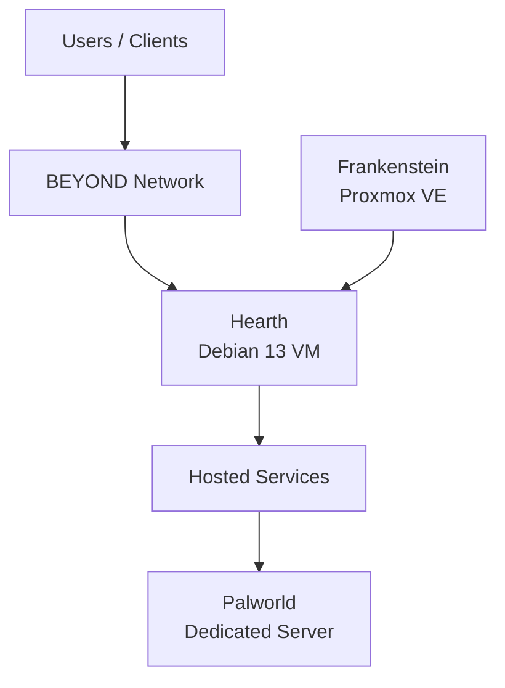
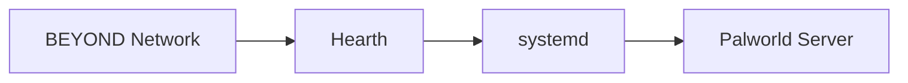
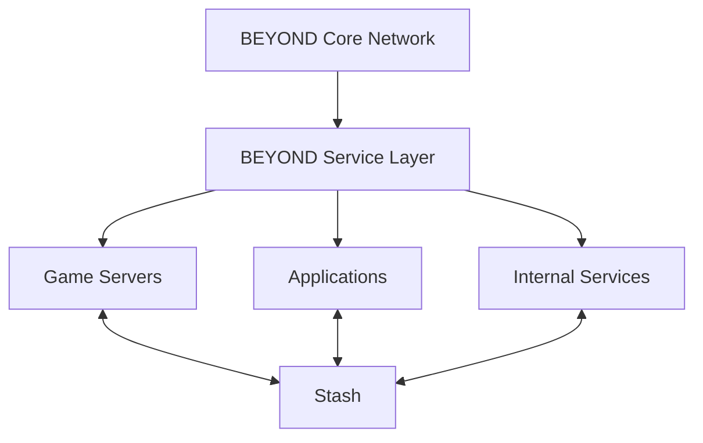
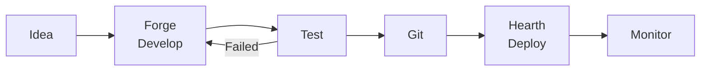

# Hearth

### Hosted Services for Project BEYOND

Hearth is the dedicated services environment for Project BEYOND.

While Frankenstein provides virtualization, IRIS provides local AI, Forge
provides development, and Stash provides storage, Hearth provides somewhere for
persistent hosted applications and game servers to live.

The first operational Hearth workload is a dedicated Palworld server.

The long-term objective is to provide a general-purpose service environment
without mixing recreational or application workloads with development or AI
infrastructure.

---

# The Goal

BEYOND needs somewhere to run services that should remain available
independently of development work.

Hearth was created for that purpose.

Potential workloads include:

- Dedicated game servers
- Self-hosted applications
- Internal services
- Web applications
- Automation services
- Experimental network services
- Future containerized workloads

The basic principle is:

**If it needs to stay running, it shouldn't live in Forge.**

---

# Current Architecture

Hearth currently runs as a dedicated Debian virtual machine hosted by
Frankenstein.



This separates persistent services from the development and AI environments.

---

# Current VM Configuration

| Component | Configuration |
|---|---|
| Host | Frankenstein |
| Hypervisor | Proxmox VE |
| Virtualization | KVM |
| Operating System | Debian GNU/Linux 13 |
| vCPU | 4 |
| Memory | ~16 GB |
| Virtual Disk | 80 GB |
| Filesystem | ext4 |
| Swap | ~4 GB |
| Containers | None |
| Primary Current Workload | Palworld Dedicated Server |

Hearth currently runs services directly on Debian rather than using a container
platform.

---

# First Workload — Palworld

Hearth's first operational workload is a Palworld dedicated server.

The server runs as a persistent systemd service:

```text
palworld.service
```

The service is currently active and running.

This means the game server does not depend on an interactive user session.

Conceptually:

```text
Frankenstein
     │
     ▼
   Hearth
     │
     ▼
systemd
     │
     ▼
palworld.service
     │
     ▼
Palworld Dedicated Server
```

This is Hearth's first real hosted workload and establishes the basic model for
future persistent services.

---

# Why Hearth Exists

It would be possible to run the Palworld server directly on another BEYOND
system.

That would also mix unrelated responsibilities.

For example, putting the server inside Forge would mean development work and a
persistent service share the same operating environment.

Putting it inside IRIS would mix recreational services with the AI platform.

Instead:

```text
IRIS
 └── AI

Forge
 └── Development

Hearth
 └── Hosted Services
```

Each environment can evolve around its own purpose.

---

# Service Management

Hearth currently uses Linux systemd to manage persistent services.

The Palworld server demonstrates this approach.

A system service provides several advantages:

- Starts independently of a user login
- Can start automatically with the VM
- Can be stopped and restarted predictably
- Provides centralized service status
- Integrates with Linux logging
- Can be managed remotely

As additional workloads are introduced, BEYOND can determine whether native
services remain appropriate or whether containerization becomes useful.

---

# No Docker — Yet

Docker is not currently installed on Hearth.

That is intentional in the sense that BEYOND does not need to introduce a
technology simply because it is commonly used.

The current Palworld workload operates without it.

Future services may create a legitimate reason to introduce:

- Docker
- Docker Compose
- Podman
- Container orchestration

If that happens, Hearth provides a natural environment for experimenting with
containerized services.

Until then:

**If the existing architecture works, it stays simple.**

---

# Current Service Model

The current Hearth architecture is straightforward.



This simplicity makes the environment easy to understand, troubleshoot, and
rebuild.

---

# Relationship With Frankenstein

Hearth is logically separated from other BEYOND workloads but still physically
depends on Frankenstein.

Frankenstein currently provides:

- CPU resources
- Memory
- Virtual storage
- Virtual networking
- Proxmox virtualization

Hearth consumes those resources as an isolated VM.

```text
              Frankenstein
                   │
        ┌──────────┼──────────┐
        │          │          │
      IRIS       Forge      Hearth
       AI         Dev       Services
```

This provides software separation but not hardware independence.

---

# Relationship With Stash

Hearth currently has an 80 GB virtual disk.

As hosted services grow, persistent application data should not necessarily
remain tied exclusively to Hearth's virtual disk.

Stash creates a future path for separating service compute from persistent
service data.

A future architecture could look like:

```text
       Hearth
          │
          │ Service Data
          ▼
    BEYOND Network
          │
          ▼
        Stash
```

This becomes increasingly important as services accumulate data that should
survive VM rebuilds or migrations.

---

# Current Limitations

Hearth is operational, but the current implementation has several limitations.

## Single Physical Host

Hearth depends on Frankenstein.

If Frankenstein is offline, Hearth and its hosted services are offline.

---

## Limited Local Storage

Hearth currently has an 80 GB virtual disk.

That is sufficient for the current role but may become restrictive as
additional applications or game servers are introduced.

---

## No Service Redundancy

The current Palworld service runs from a single VM on a single physical host.

There is no high-availability or failover architecture.

That is acceptable for the current workload.

---

## Shared Resources

Hearth shares Frankenstein's physical CPU, memory, storage, and networking with
other BEYOND workloads.

Resource usage will become more important as additional services are added.

---

## Physical Network Limitation

Hearth's traffic ultimately passes through Frankenstein's physical network
connection.

Frankenstein currently connects to the BEYOND network at 1 GbE.

Future upgrades to Frankenstein's networking will therefore also improve the
available physical network path for Hearth.

---

# Future Workloads

Hearth is intended to become a general-purpose service environment rather than
a VM dedicated permanently to one game.

Potential future workloads include:

- Additional dedicated game servers
- Minecraft
- Self-hosted applications
- Internal web services
- Monitoring tools
- Utility services
- Automation services
- Test applications
- Containerized workloads

Not every service will necessarily remain on one Hearth VM forever.

Hearth establishes the service layer.

That layer can eventually expand into multiple systems.

---

# Future Architecture

As BEYOND grows, hosted services may eventually expand beyond a single VM.



At that point, Hearth becomes less about one particular VM and more about the
role it established inside BEYOND.

---

# Monitoring

As Hearth gains additional persistent workloads, monitoring becomes increasingly
important.

Future monitoring should provide visibility into:

- CPU utilization
- Memory utilization
- Disk capacity
- Network activity
- Service availability
- Service failures
- Game-server health
- System uptime

Eventually, BEYOND should be able to determine that a Hearth service has failed
without waiting for someone to discover it manually.

---

# Backup and Recovery

Persistent services eventually create persistent data.

That creates a requirement for backup and recovery.

Future Hearth development should include:

- VM backup
- Service configuration backup
- Persistent-data backup
- Restore testing
- Migration procedures

Stash will likely become part of this architecture as BEYOND's storage platform
matures.

A backup is only useful if it can actually be restored.

---

# Development Workflow

Forge and Hearth create a natural separation between development and hosted
services.



This creates the beginning of a development-to-deployment workflow inside
BEYOND.

Forge builds.

Hearth runs.

---

# Development Roadmap

## Hearth MK1 — Current

- Debian 13
- 4 vCPU
- ~16 GB RAM
- 80 GB virtual disk
- Native systemd services
- Palworld dedicated server

## Service Expansion

Future development may include:

- Minecraft server
- Additional game servers
- Internal applications
- Shared storage integration
- Improved service management
- Automated deployment
- Centralized logging

## Infrastructure Expansion

Long-term development may include:

- Containerized services
- Dedicated application compute
- Service monitoring
- Automated backups
- High-speed storage access
- Improved network connectivity
- Multiple service hosts
- Infrastructure automation

---

# What Hearth Has Already Proven

Hearth began as a place to put services.

It now has an actual persistent workload.

That matters.

The Palworld server establishes the first version of a broader BEYOND pattern:

```text
Build somewhere else.

Deploy to Hearth.

Keep it running.
```

The workload itself may change.

The architectural role remains useful.

---

# Development Philosophy

Hearth should grow because services need somewhere to live.

Not because BEYOND needs another server for the sake of having another server.

Start with one service.

Learn how to operate it.

Learn how to monitor it.

Learn how to back it up.

Then add another.

**Hearth is where BEYOND keeps the fire burning.**
