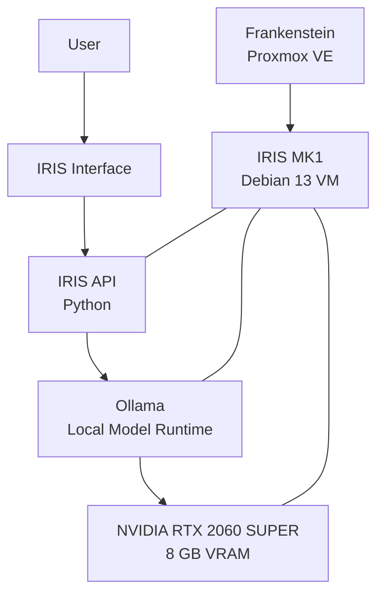
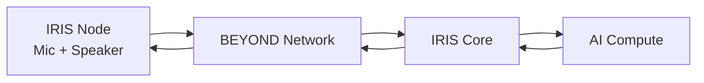
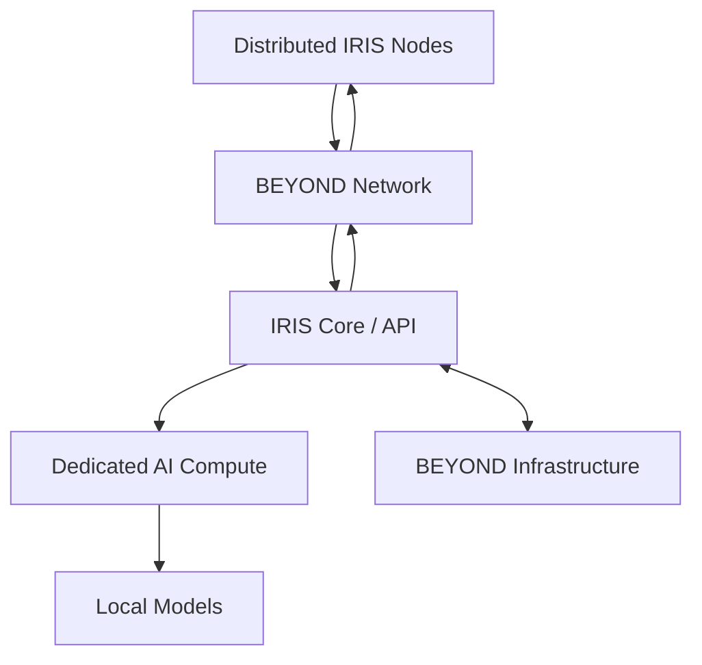

# IRIS MK1

### Local AI for Project BEYOND

IRIS is the locally hosted AI system being developed as part of Project BEYOND.

The objective is not simply to run a local language model.

The long-term goal is to build an AI system that lives inside the BEYOND
environment, can interact with its infrastructure, and can eventually extend
beyond a single computer through distributed nodes.

The current implementation is **IRIS MK1**.

IRIS is still under active development.

---

# The Goal

IRIS began with a relatively simple objective:

**Run an AI assistant locally.**

That objective quickly expanded.

The long-term vision for IRIS includes:

- Local AI inference
- Voice interaction
- GPU acceleration
- Infrastructure awareness
- BEYOND system integration
- Infrastructure automation
- Distributed microphone and speaker nodes
- Home-wide interaction
- Dedicated AI compute
- Reduced dependence on external AI services

IRIS is intended to become a persistent part of BEYOND rather than an
application running on a workstation.

---

# Current Architecture

IRIS MK1 currently runs as a dedicated virtual machine hosted by Frankenstein.



---

# Current VM Configuration

| Component | Configuration |
|---|---|
| Host | Frankenstein |
| Hypervisor | Proxmox VE |
| Virtualization | KVM |
| Operating System | Debian GNU/Linux 13 |
| vCPU | 4 |
| Memory | ~12 GB |
| Storage | 128 GB virtual disk |
| GPU | NVIDIA GeForce RTX 2060 SUPER |
| GPU Memory | 8 GB |
| NVIDIA Driver | 550.163.01 |
| CUDA | 12.4 |
| Python | 3.13 |
| AI Runtime | Ollama |
| IRIS Application | Custom Python service |
| Containers | None |

IRIS currently runs its primary services directly on Debian rather than through
Docker.

---

# GPU Acceleration

IRIS MK1 has direct access to Frankenstein's NVIDIA GeForce RTX 2060 SUPER.

The GPU provides:

- 8 GB VRAM
- CUDA support
- Local AI acceleration
- A platform for testing GPU-backed inference

The RTX 2060 SUPER is currently the primary usable AI accelerator within
Project BEYOND.

This configuration allows IRIS to use dedicated GPU resources while remaining
inside a virtualized environment.

---

# Ollama

Ollama currently provides the local model runtime used by IRIS.

It runs as a persistent system service inside the IRIS VM.

```text
ollama.service
└── /usr/local/bin/ollama serve
```

This allows the model runtime to remain available independently of an
interactive user session.

---

# IRIS API

IRIS includes a custom Python application running as a dedicated system service.

Current service:

```text
iris-api.service
```

Application:

```text
/opt/iris/iris.py
```

The service currently exposes the IRIS local text API on the loopback interface.

This provides a separation between the IRIS application layer and the local
model runtime.

Conceptually:

```text
Interface
    │
    ▼
IRIS API
    │
    ▼
Ollama
    │
    ▼
Local Model
    │
    ▼
RTX 2060 SUPER
```

This architecture provides a foundation for adding additional interfaces and
capabilities without requiring those interfaces to communicate directly with
the model runtime.

---

# Voice

IRIS has begun moving beyond text-only interaction.

The current development version supports a voice interaction workflow where
spoken input can be converted into text, submitted to IRIS, and the resulting
response can be spoken back to the user.

The current interaction is still user-driven rather than a persistent
always-listening assistant.

Voice development is an active part of the project.

The long-term objective is to separate voice interaction from the primary
interface and allow dedicated nodes to communicate with IRIS over the BEYOND
network.

---

# Distributed IRIS

IRIS is not intended to remain tied to one interface.

A future phase of the project will introduce distributed IRIS nodes.

Potential nodes may contain:

- Microphone
- Speaker
- Small network-connected computer
- Push-to-talk or wake interaction
- Local status indication

The node itself would not need to run the primary AI model.

Instead:



This would allow the compute-intensive portion of IRIS to remain centralized
while interaction points can exist throughout the environment.

---

# The Second GPU Problem

Frankenstein contains a second NVIDIA GPU:

**GeForce GTX 1660**

The original intention was to make additional GPU resources available for
experimentation.

That configuration is not currently operational.

The GTX 1660 is installed and visible to the Proxmox host, but the current PCIe
and IOMMU configuration prevents it from being independently passed through to
IRIS as intended.

Attempts to allocate the GTX 1660 to IRIS result in a black-screen boot.

Moving the GPU to another PCIe slot is currently prevented by physical
clearance between the card and Frankenstein's power supply.

As a result:

```text
RTX 2060 SUPER
      │
      └── Active IRIS GPU

GTX 1660
      │
      └── Installed / Currently Unused
```

Possible future solutions include:

- PCIe topology changes
- PCIe riser hardware
- Chassis changes
- Platform changes
- Dedicated AI compute

Rather than hiding the limitation, BEYOND will document how it is eventually
resolved.

---

# Current Capabilities

IRIS MK1 currently provides a foundation for:

- Locally hosted AI inference
- GPU-accelerated inference
- Custom Python API access
- Ollama model hosting
- Text interaction
- Experimental voice interaction
- Remote administration
- Persistent system services

These capabilities represent the first functional stage of IRIS rather than the
final architecture.

---

# Current Limitations

IRIS MK1 is currently constrained by several areas.

## GPU Memory

The RTX 2060 SUPER provides 8 GB of VRAM.

This limits the size and complexity of models that can run entirely within
available GPU memory.

## Secondary GPU

The GTX 1660 is not currently available to IRIS.

## VM Resources

IRIS currently operates with approximately:

- 4 vCPUs
- 12 GB system memory
- 128 GB storage

These resources are sufficient for current experimentation but are not intended
to represent the final IRIS compute platform.

## Compute Concentration

IRIS currently depends on Frankenstein.

If Frankenstein is offline, IRIS is offline.

The long-term architecture separates AI compute from the primary virtualization
host.

## Voice Architecture

Voice interaction exists, but distributed voice nodes and persistent
room-level interaction have not yet been implemented.

---

# Why Dedicated AI Compute?

IRIS is beginning on consumer hardware because BEYOND is intended to prove ideas
before dedicated infrastructure is introduced.

The RTX 2060 SUPER provides enough capability to develop the architecture and
experiment with local inference.

But the long-term IRIS roadmap introduces workloads that may require
substantially more compute and GPU memory.

These include:

- Larger local models
- Faster inference
- Multiple simultaneous services
- Speech processing
- Distributed interaction
- Infrastructure automation
- Multiple GPU workloads
- Future multimodal capabilities

For that reason, dedicated AI compute is part of the long-term BEYOND
architecture.

---

# Target Architecture



In this architecture, IRIS becomes a service provided by BEYOND rather than a
single VM tied to one piece of hardware.

---

# Development Roadmap

## IRIS MK1 — Current

- Debian VM
- Ollama
- Custom Python API
- RTX 2060 SUPER acceleration
- Text interaction
- Experimental voice interaction

## IRIS MK2 — Expansion

Planned areas of development include:

- Improved voice pipeline
- Improved model management
- BEYOND infrastructure integration
- Monitoring
- Expanded automation
- Additional interfaces
- Initial distributed node testing

## Future IRIS

Long-term development includes:

- Dedicated AI compute
- Larger GPU memory capacity
- Multi-GPU capability
- Distributed voice nodes
- Home-wide interaction
- Infrastructure awareness
- BEYOND service control
- Local-first operation
- Persistent AI services

---

# Development Philosophy

IRIS will grow the same way the rest of BEYOND grows.

Start with what is available.

Build something functional.

Find the limitation.

Understand the limitation.

Then upgrade because there is a reason to upgrade.

The RTX 2060 SUPER doesn't need to be the final AI platform.

It needs to provide enough capability to build the system that eventually
justifies replacing it.

**IRIS MK1 is that beginning.**
