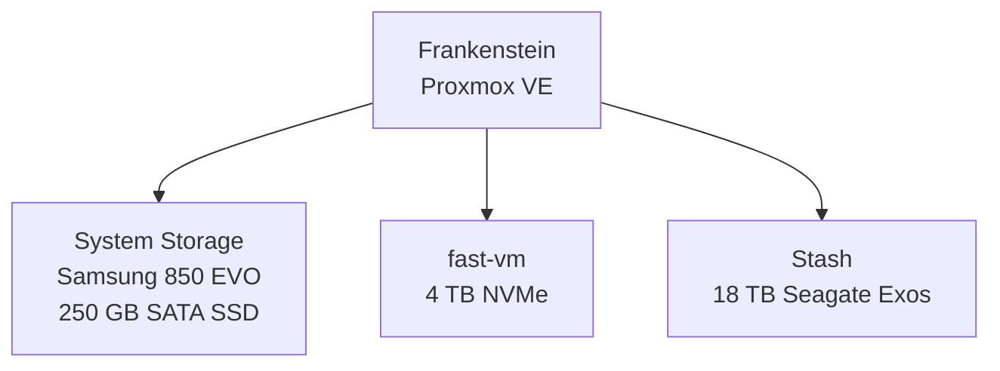
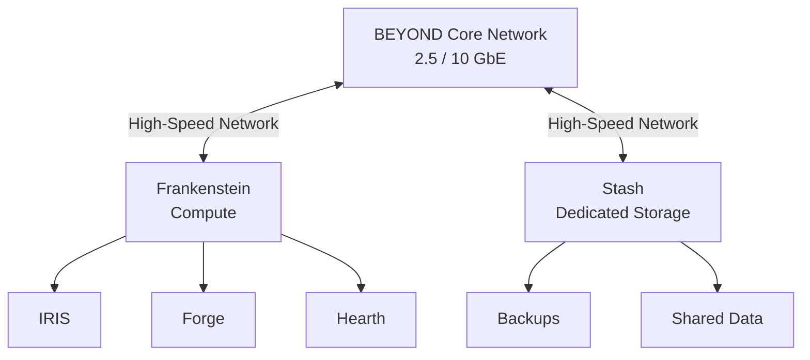

# Stash

### Storage for Project BEYOND

Stash is the storage layer of Project BEYOND.

Today, Stash exists as an 18 TB enterprise hard drive installed directly
inside Frankenstein and exposed to Proxmox as a dedicated storage resource.

Long term, Stash is intended to become something much larger:

**Independent storage infrastructure for BEYOND.**

The current implementation is the beginning of that system.

---

# The Goal

BEYOND generates and depends on data.

Virtual machines need backups.

Infrastructure needs configuration backups.

Projects need persistent storage.

Documentation needs somewhere to live.

Future services will need shared storage.

IRIS will eventually generate and consume increasing amounts of data.

The long-term purpose of Stash is to provide a centralized storage platform
that exists independently of BEYOND's compute infrastructure.

The target is simple:

**Compute should compute.**

**Storage should store.**

Today, those responsibilities are still combined.

---

# Stash Today

The current Stash implementation consists of:

| Component | Configuration |
|---|---|
| Drive | Seagate Exos ST18000NM000J |
| Advertised Capacity | 18 TB |
| Filesystem | ext4 |
| Host | Frankenstein |
| Mount Point | `/mnt/pve/stash` |
| Proxmox Storage ID | `stash` |
| Connection | Direct-attached storage |
| Redundancy | None |
| Independent Storage Host | No |

The drive is physically installed inside Frankenstein and directly attached to
the host.

Proxmox mounts the filesystem at:

```text
/mnt/pve/stash
```

and exposes it as the storage resource:

```text
stash
```

---

# Current Capacity

At the time of this documentation, Stash is mostly empty.

Approximate current filesystem capacity:

```text
Capacity:   ~17 TB
Used:       ~42 GB
Available:  ~16 TB
```

That provides significant room for BEYOND to grow before raw capacity itself
becomes the immediate limitation.

The larger limitation is architecture.

---

# Current Storage Architecture

Frankenstein currently contains all three major BEYOND storage tiers.



Each storage device currently serves a different purpose.

---

# System Storage

Frankenstein's Proxmox installation resides on a Samsung 850 EVO SATA SSD.

This drive provides the host operating environment and local Proxmox storage.

It is not intended to serve as the primary high-performance VM or bulk-storage
device.

---

# fast-vm

The 4 TB TEAMGROUP NVMe SSD provides the high-performance storage tier.

Within Proxmox it is configured as:

```text
fast-vm
```

using LVM-thin storage.

This tier currently provides storage for virtual machines and containers where
higher storage performance is useful.

The NVMe device separates active virtual workloads from slower bulk storage.

Conceptually:

```text
VMs / Containers
       │
       ▼
    fast-vm
       │
       ▼
   4 TB NVMe
```

---

# Stash

Stash provides the bulk-capacity tier.

The 18 TB Seagate Exos drive currently uses an ext4 filesystem and is mounted
directly by Frankenstein.

Within Proxmox, Stash is configured to support multiple content types,
including:

- Backups
- Disk images
- Container root directories
- ISO images
- Container templates
- Snippets

This makes Stash a flexible general-purpose storage resource while BEYOND is
still operating primarily from a single physical host.

---

# Current Data

Stash already contains directories supporting several BEYOND functions,
including:

```text
BEYOND-DOCS
dump
images
private
share
snippets
template
```

These currently support a combination of BEYOND documentation, Proxmox storage,
shared data, templates, and backup-related functions.

The exact organization of Stash will continue to evolve as dedicated storage
infrastructure is developed.

---

# The Problem

Stash currently provides capacity.

It does not yet provide storage independence.

The 18 TB drive physically lives inside Frankenstein.

That means the current architecture looks like this:

```text
          Frankenstein
               │
      ┌────────┼────────┐
      │        │        │
   Compute   VMs     Storage
                        │
                        ▼
                      Stash
```

If Frankenstein needs to be:

- Rebuilt
- Replaced
- Taken offline
- Serviced
- Migrated
- Reconfigured

then Stash is physically tied to that work.

This creates unnecessary coupling between BEYOND's compute and storage layers.

---

# The Second Problem — Redundancy

Stash currently consists of a single 18 TB hard drive.

That provides capacity.

It does **not** provide redundancy.

If the drive fails, the storage provided by that disk becomes unavailable.

The current Stash implementation should therefore not be confused with a
complete backup or highly available storage solution.

One large disk is still one disk.

Future Stash infrastructure needs to account for:

- Disk failure
- Backup strategy
- Data recovery
- Storage redundancy
- Monitoring
- Drive replacement
- Capacity expansion

---

# The Third Problem — Networking

Separating Stash from Frankenstein creates another requirement:

**The network becomes part of the storage architecture.**

Today, direct-attached storage does not need to cross the BEYOND network.

A dedicated storage system would.

Frankenstein currently connects to the BEYOND network at 1 GbE.

That would create a significant limitation for high-speed network storage.

The future of Stash is therefore directly connected to the future of the
BEYOND network.

Storage evolution and network evolution need to happen together.

---

# Target Architecture

The long-term goal is to move Stash away from Frankenstein and turn it into an
independent storage system.



In this architecture, Frankenstein consumes storage services from Stash rather
than physically containing Stash.

That separation allows both systems to evolve independently.

---

# Future Stash

A dedicated Stash system could eventually provide:

- Multiple storage drives
- Storage redundancy
- Network-accessible storage
- VM backups
- Infrastructure backups
- Shared project storage
- Media and application storage
- BEYOND documentation storage
- Monitoring
- Drive health reporting
- Expandable capacity
- Faster network connectivity

The final implementation has not been selected yet.

That is intentional.

BEYOND will evaluate the requirements before deciding what hardware and storage
architecture makes sense.

---

# Hardware Questions

Moving Stash into dedicated infrastructure introduces several areas that need
to be tested and evaluated.

These include:

- Dedicated NAS hardware vs custom-built storage
- Rackmount vs desktop storage chassis
- SATA and SAS connectivity
- Host Bus Adapters
- Drive expansion
- Storage filesystems
- RAID or software-defined redundancy
- SSD caching
- 2.5 GbE storage networking
- 10 GbE storage networking
- SFP+ connectivity
- Backup targets
- UPS integration
- Storage monitoring

These are not theoretical upgrade categories.

Each represents a problem that will need to be solved as Stash becomes
independent infrastructure.

---

# Migration Strategy

Stash does not need to become a full storage server overnight.

The likely evolution is incremental.

## Stage 1 — Direct-Attached Storage

**Current**

- 18 TB Seagate Exos
- Installed in Frankenstein
- ext4 filesystem
- Proxmox storage resource
- No storage redundancy

## Stage 2 — Storage Separation

Move bulk storage away from the primary compute host.

Goals:

- Dedicated storage system
- Independent administration
- Network-based access
- Basic monitoring
- Defined backup strategy

## Stage 3 — High-Speed Storage Network

Improve connectivity between compute and storage.

Potential goals:

- 2.5 GbE minimum
- 10 GbE backbone
- Dedicated storage interfaces
- Improved transfer performance

## Stage 4 — Resilient Storage

Introduce additional drives and failure protection.

Goals:

- Disk redundancy
- Drive-health monitoring
- Recovery procedures
- Capacity expansion
- Backup validation

## Stage 5 — BEYOND Storage Platform

Stash becomes the central storage service for BEYOND.

```text
             STASH
               │
       ┌───────┼────────┐
       │       │        │
     VMs    Backups   Shared Data
       │       │        │
       └───────┼────────┘
               │
         BEYOND Network
               │
    ┌──────────┼──────────┐
    │          │          │
Frankenstein  IRIS    Future Hosts
```

At that point, Stash is no longer a hard drive.

It is infrastructure.

---

# What Stash Has Already Taught BEYOND

The current system demonstrates an important distinction:

**Capacity and architecture are not the same thing.**

An 18 TB enterprise drive provides a large amount of storage capacity.

But capacity alone does not provide:

- Redundancy
- Independence
- High availability
- Backups
- Disaster recovery
- High-speed network access

Those capabilities require infrastructure around the storage.

The current drive solved the first problem:

**BEYOND needed space.**

Now Stash can begin solving the larger problem:

**BEYOND needs storage infrastructure.**

---

# Development Philosophy

Like Frankenstein and IRIS, Stash will evolve because of actual requirements
rather than upgrades for the sake of upgrades.

The current 18 TB drive works.

So BEYOND will use it.

Its limitations are also now clearly understood.

When Stash moves into dedicated hardware, the upgrade will solve documented
problems rather than simply add equipment.

**Start with a drive.**

**Learn what the drive can't provide.**

**Build the infrastructure around it.**
