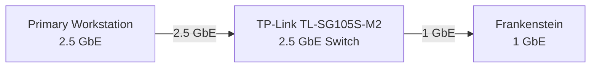

# BEYOND Benchmark 001 — Frankenstein 1 GbE Baseline

## Establishing the Network Baseline Before Multi-Gigabit Expansion

Project BEYOND currently uses a 2.5 GbE switching layer, but its primary
virtualization host, Frankenstein, remains connected at 1 GbE.

Before upgrading Frankenstein's network interface, a baseline was established
to answer a simple question:

> Is Frankenstein's current network connection underperforming, or has the
> existing 1 GbE interface simply reached its practical limit?

The answer matters.

Replacing poorly configured hardware and replacing hardware that has reached
its architectural limit are two different things.

This benchmark establishes the starting point.

---

# Test Objective

The objective was to measure TCP throughput between:

- A 2.5 GbE workstation
- Frankenstein's 1 GbE interface

The test was designed to determine:

1. Maximum single-stream throughput to Frankenstein
2. Maximum single-stream throughput from Frankenstein
3. Whether multiple TCP streams increase aggregate throughput
4. Whether obvious network instability or retransmission is present
5. Whether the 1 GbE physical link represents a meaningful BEYOND bottleneck

---

# Test Environment

## Client

**Primary Workstation**

| Component | Configuration |
|---|---|
| Operating System | Windows |
| Network Connection | 2.5 GbE |
| Role | iperf3 client |
| iperf3 Version | 3.21 |

## Server

**Frankenstein**

| Component | Configuration |
|---|---|
| Platform | Proxmox VE |
| Host OS | Debian GNU/Linux 13 |
| CPU | Intel Core i7-8700K |
| Network Connection | 1 GbE |
| Role | iperf3 server |
| iperf3 Version | 3.18 |

## Network

The systems communicate through the BEYOND network.



The workstation therefore has more available link capacity than Frankenstein.

The expected bottleneck is the final 1 GbE connection between the switch and
Frankenstein.

---

# Test Tool

Testing was performed using **iperf3**.

iperf3 generates network traffic directly between two systems, allowing network
throughput to be measured without introducing storage performance as another
major variable.

This is important because a normal file-transfer test could be affected by:

- Disk performance
- Filesystem performance
- File caching
- Protocol overhead
- Storage contention

The purpose of this test was specifically to establish a network baseline.

---

# Test Methodology

Three TCP tests were performed.

Each test ran for approximately 30 seconds.

## Test 1

Single TCP stream:

```text
Primary Workstation → Frankenstein
```

Command:

```bash
iperf3 -c <FRANKENSTEIN-IP> -t 30
```

---

## Test 2

Single TCP stream in reverse mode:

```text
Frankenstein → Primary Workstation
```

Command:

```bash
iperf3 -c <FRANKENSTEIN-IP> -t 30 -R
```

---

## Test 3

Four simultaneous TCP streams:

```text
Primary Workstation → Frankenstein
```

Command:

```bash
iperf3 -c <FRANKENSTEIN-IP> -t 30 -P 4
```

The third test was intended to determine whether the single TCP stream was
preventing the connection from reaching additional available throughput.

---

# Results

| Test | Direction | Streams | Throughput |
|---|---|---:|---:|
| Test 1 | Workstation → Frankenstein | 1 | **946 Mbit/s** |
| Test 2 | Frankenstein → Workstation | 1 | **937 Mbit/s** |
| Test 3 | Workstation → Frankenstein | 4 | **946 Mbit/s received** |

Test 2 completed with:

```text
0 retransmits
```

The four-stream test reported approximately:

```text
948 Mbit/s sender
946 Mbit/s receiver
```

with approximately 3.31 GB transferred during the test.

---

# Test 1 — Single Stream to Frankenstein

The first test measured traffic from the 2.5 GbE workstation to Frankenstein.

Result:

```text
Transfer:   3.31 GBytes
Sender:     946 Mbit/s
Receiver:   946 Mbit/s
Duration:   ~30 seconds
```

Throughput remained remarkably consistent throughout the test.

Most one-second intervals remained around:

```text
945–947 Mbit/s
```

This immediately suggested that Frankenstein was approaching the practical
throughput ceiling of its 1 GbE interface.

---

# Test 2 — Single Stream From Frankenstein

The second test reversed the traffic direction.

Result:

```text
Transfer:       3.27 GBytes
Sender:         937 Mbit/s
Receiver:       937 Mbit/s
Retransmits:    0
Duration:       ~30 seconds
```

Again, throughput remained highly consistent.

Most intervals remained around:

```text
936–938 Mbit/s
```

The test also completed with zero reported TCP retransmissions on the sending
side.

This is significant because it provides no obvious indication that packet loss
or an unstable connection is responsible for the throughput ceiling observed
during testing.

---

# Test 3 — Four Parallel Streams

The final test used four simultaneous TCP streams.

The purpose was to determine whether a single TCP connection was limiting
throughput.

Result:

```text
Sender:     948 Mbit/s
Receiver:   946 Mbit/s
Transfer:   3.31 GBytes
Streams:    4
Duration:   ~30 seconds
```

The individual streams divided the available bandwidth between themselves.

Final receiver results were approximately:

| Stream | Throughput |
|---|---:|
| Stream 1 | 245 Mbit/s |
| Stream 2 | 186 Mbit/s |
| Stream 3 | 261 Mbit/s |
| Stream 4 | 253 Mbit/s |
| **Aggregate** | **946 Mbit/s** |

Adding additional TCP streams therefore did not meaningfully increase total
throughput.

Instead, the streams shared the same available link capacity.

---

# Result Visualization

```text
                BEYOND NETWORK BASELINE

 Primary Workstation                     Frankenstein
      2.5 GbE                               1 GbE
         │                                    │
         │──── Single Stream ────────────────►│
         │           946 Mbit/s               │
         │                                    │
         │◄──── Reverse Stream ───────────────│
         │           937 Mbit/s               │
         │          0 retransmits             │
         │                                    │
         │──── Four Streams ─────────────────►│
         │           946 Mbit/s               │
         │                                    │

                     Bottleneck
                         │
                         ▼
                  1 GbE Host Link
```

---

# Analysis

The results are highly consistent across all three tests.

The workstation-to-Frankenstein single-stream test reached:

**946 Mbit/s**

The reverse test reached:

**937 Mbit/s**

The four-stream test reached:

**946 Mbit/s received**

Adding additional TCP streams did not reveal significant unused bandwidth.

Instead, the four connections divided approximately the same aggregate
throughput already achieved by a single connection.

The existing connection is therefore not showing evidence in these tests of
being substantially underutilized.

It is reaching the practical throughput expected from a 1 GbE Ethernet link.

---

# Bottleneck Identified

The current network path is:

```text
Primary Workstation
      │
    2.5 GbE
      │
      ▼
BEYOND Switch
      │
     1 GbE
      │
      ▼
Frankenstein
```

The switch and workstation are capable of operating beyond 1 GbE.

Frankenstein currently is not.

The benchmark demonstrates that the host is already consuming essentially all
of the useful bandwidth available from its existing gigabit connection.

This makes Frankenstein's physical network interface a documented BEYOND
infrastructure limitation.

---

# What This Test Does Not Prove

This benchmark is intentionally narrow.

It does **not** measure:

- Internet performance
- Stash disk performance
- VM storage performance
- Application performance
- Network performance between every BEYOND system
- Latency under complex workloads
- Maximum performance of the 2.5 GbE switch
- Maximum performance of the workstation's 2.5 GbE interface

It establishes one thing:

**The current network throughput between the primary workstation and
Frankenstein is constrained at approximately gigabit Ethernet speeds.**

That gives future testing a measurable baseline.

---

# Upgrade Target

The next logical network upgrade is to increase Frankenstein's physical network
connection beyond 1 GbE.

Potential upgrade paths include:

- 2.5 GbE PCIe Ethernet
- 10 GbE Ethernet
- SFP+
- DAC-based connectivity

The final choice will depend on BEYOND's broader network architecture.

A future upgrade test should repeat this exact benchmark methodology.

That will allow direct comparison between:

```text
Before Upgrade
~946 Mbit/s

        vs.

After Upgrade
TBD
```

---

# Why the Baseline Matters

Without this test, a future network upgrade could only be described as:

> The new NIC is faster.

That is not particularly useful.

BEYOND now has measured evidence of the original environment.

When Frankenstein receives a faster network interface, the same tests can be
repeated.

The comparison can then answer:

- How much throughput increased
- Whether single-stream performance improved
- Whether parallel streams behave differently
- Whether another bottleneck appears
- Whether the upgrade materially improves the environment

The upgrade itself becomes an experiment rather than an assumption.

---

# Benchmark Result

## Frankenstein 1 GbE Baseline

**Single-stream inbound**

```text
946 Mbit/s
```

**Single-stream outbound**

```text
937 Mbit/s
```

**Four-stream aggregate**

```text
946 Mbit/s received
```

**Observed retransmits during reverse test**

```text
0
```

### Finding

**Frankenstein's existing 1 GbE connection is healthy and effectively
saturated.**

The current limitation is not a lack of utilization.

The limitation is the link itself.

---

# Next Test

This benchmark establishes the baseline for Frankenstein's eventual
multi-gigabit network upgrade.

When that upgrade occurs, BEYOND Benchmark 001 will be repeated using the same
basic methodology.

Then the numbers get to decide whether the upgrade was worth it.

---

**Build it. Test it. Measure it. Improve it.**
